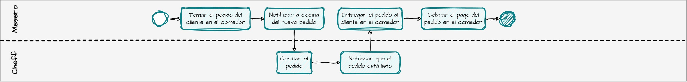
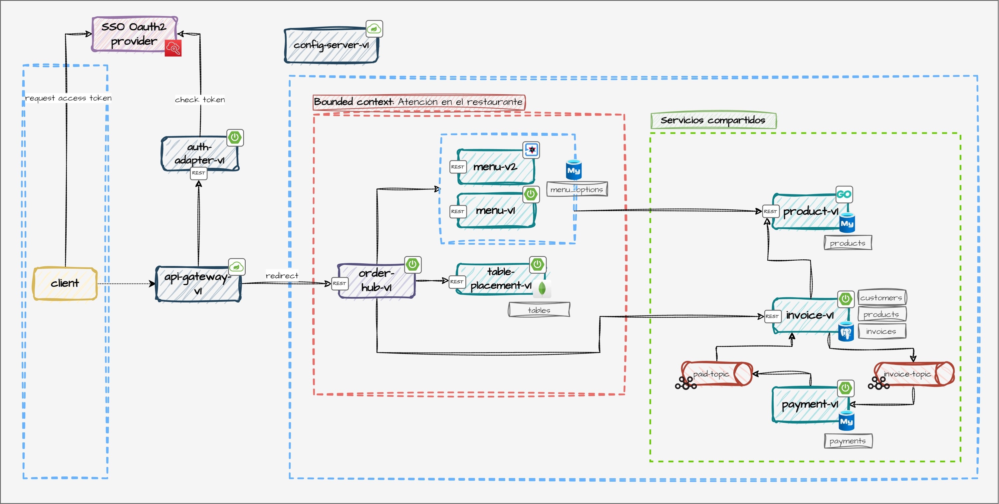

# BBQ RESTAURANT

# 1. INSTRUCCIONES DE DESPLIEGUE
- [Local](devops/scripts/local/README.md)
- [Docker](devops/scripts/docker/README.md)
- [Kubernetes](devops/scripts/k8s/README.md)
- [Jenkins](devops/scripts/jenkins/README.md)

# 2. DOCUMENTACION
- [Backend](./docs/info/backend/README.md)

# 3. CASO DE ESTUDIO
BBQ Restaurant es una cadena de restaurantes que planea implementar una arquitectura de microservicios para mejorar la escalabilidad y la eficiencia operativa en su creciente red de restaurantes.
Los expertos en el dominio "restaurante" utilizan los siguientes procesos para prestar servicios a sus clientes.

> 💡 **Atención en el comedor**



# 4. DISEÑO DEL SOFTWARE

> ⚙️ **Diagrama de arquitectura de software**



> 📝 **Descripción de los servicios web**

| Servicio web         | Descripción                                                                                                                   | Stack                                                             |   
|----------------------|-------------------------------------------------------------------------------------------------------------------------------|-------------------------------------------------------------------|
| `product-v1`         | Permite gestionar los productos que ofrece el restaurante BBQ (CRUD).                                                         | **GO**: `GORM`                                                    |
| `menu-v1`            | Permite gestionar las opciones de menú que ofrece el restaurante BBQ (CRUD), siendo las opciones de menú un tipo de producto. | **Spring Boot**: `JPA`, `RestTemplate`                            |
| `menu-v2`            | Cumple el mismo propósito que menu-v1 (CRUD).                                                                                 | **Quarkus**: `Panache Entity`, `RestClient`, `Multiny`, `GraphQL` |
| `table-placement-v1` | Permite realizar la colocación de la mesa, es decir que permite agregar pedidos en cada mesa y consultarlos.                  | **WebFlux**: `MongoDB Reactive`, `RouterFunctions`                |
| `invoice-v1`         | Permite generar una factura de proforma y enviarla a pagar.                                                                   | **WebFlux**: `Retrofit`, `Kafka`, `Drools`, `JPA`                 |
| `payment-v1`         | Recibe las facturas y las procesa.                                                                                            | **RxJava**: `Kafka`, `JPA`                                        |
| `order-hub-v1`       | `Backend for Frontend` Construye la experiencia de generación de pedidos.                                                     | **WebFlux**: `Retrofit`                                           |
| `config-server-v1`   | Servicio de configuraciones.                                                                                                  | **Spring Cloud**                                                  |
| `api-gateway-v1`     | API Gateway.                                                                                                                  | **WebFlux**: `Webflux`, `WebClient`                               |
| `auth-adapter-v1`    | Adaptador de autenticación.                                                                                                   | **RxJava**: `Retrofit`                                            |

# 5. ESTRUCTURA DEL REPOSITORIO

```javascript
    bbq-monorepo
    │───`application`
    │   ├───backend
    │   │   ├───business              // servicios web con lógica de negocio 
    │   │   │   ├───product-v1
    │   │   │   ├───menu-v1
    │   │   │   └─── ...
    │   │   ├───commons              // no ejecutables con dependencias/utilidades comunes 
    │   │   │   ├───parent-quarkus-commons-v1
    │   │   │   ├───commons-quarkus-v1
    │   │   │   └─── ...
    │   │   └───infrastructure        // servicios web de infraestructura
    │   │       ├───api-gateway-v1
    │   │       ├───config-server-v1
    │   │       └─── ...
    │   └───frontend
    │       └───bbq-restaurant-web
    │───`devops`                      // estrategias de despliegue                   
    │   ├───docker-compose
    │   ├───jenkins
    │   ├───k8s
    │   └───local
    └───`docs`
        ├───diagrams                  // imágenes y archivos draw.io
        ├───info                      // documentación
        ├───load-testing              // scripts de prueba de carga en JMeter e informes
        └───postman
```


