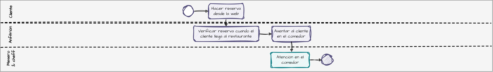
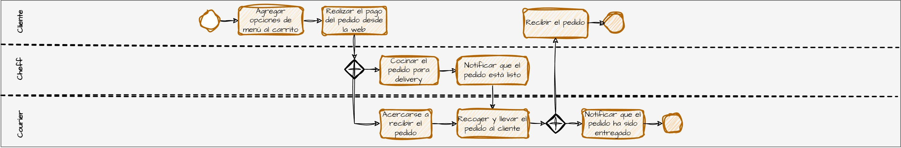

# BBQ RESTAURANT

# 1. CASO DE ESTUDIO
BBQ Restaurant es una cadena de restaurantes que planea implementar una arquitectura de microservicios para mejorar la escalabilidad y la eficiencia operativa en su creciente red de restaurantes.
Los expertos en el dominio "restaurante" utilizan los siguientes procesos para prestar servicios a sus clientes.


> 💡 **Atención en el comedor**
>


> 💡 **Reserva en línea**




> 💡 **Delivery**



# 2. DISEÑO DEL SOFTWARE

> 📌 **Glosario**
- **Dominio**: Área de conocimiento (conceptos, reglas, requisitos) que el software está destinado a abordar. Por lo general, cada `servicio web` aborda un `dominio` específico.
- **Subdominio**: Área de conocimiento más específica dentro del dominio principal. Por lo general, los `subdominios` de cada servicio web son representados por los `modelos de datos` de sus fuentes de información (capa `repository`).
- **Modelo de datos**: Modelo que captura la estructura y el significado de los datos en un subdominio específico.
- **Contexto**: Funcionalidad del sistema que puede abarcar uno o más subdominios. Los contextos ayudan a delimitar las responsabilidades entre los componentes del sistema.

> 🔍 **Ejemplo**
- **Dominio**: `Colocación de pedidos en mesa`
- **Subdominios**: `Mesas` y `pedidos`
- **Contextos**:
  - `Colocación de pedidos`: Se encarga de tomar los pedidos de los clientes y asignarlos a una mesa específica.
  - `Gestión de estado de mesa`: Controla el estado de ocupación de las mesas, indicando si están disponibles, ocupadas o reservadas.

> ⚙️ **Diagrama de arquitectura de software**


> 📝 **Descripción de los servicios web**

| Servicio web                   | Descripción                                                                                                                   | Stack                                                         |   
|--------------------------------|-------------------------------------------------------------------------------------------------------------------------------|---------------------------------------------------------------|
| `product-v1`                   | Permite gestionar los productos que ofrece el restaurante BBQ (CRUD).                                                         | **GO**: `GORM`                                                |
| `menu-v1`                      | Permite gestionar las opciones de menú que ofrece el restaurante BBQ (CRUD), siendo las opciones de menú un tipo de producto. | **Spring Boot**: `JPA, Retrofit`                              |
| `menu-v2`                      | Cumple el mismo propósito que menu-v1 (CRUD).                                                                                 | **Quarkus**: `Panache Entity, RestClient, Multiny, GraphQL`   |
| `table-placement-v1`           | Permite realizar la colocación de la mesa, es decir que permite agregar pedidos en cada mesa y consultarlos.                  | **Spring Boot**: `MongoDB Reactive, Webflux, RouterFunctions` |
| `invoice-v1`                   | Permite generar una factura de proforma y enviarla a pagar.                                                                   | **Spring Boot**: `JPA, RxJava2, Retrofit, Kafka`              |
| `payment-v1`                   | Recibe las facturas y las procesa.                                                                                            | **Spring Boot**: `JPA, Kafka`                                 |
| `order-hub-v1`                 | `Backend for Frontend` Construye la experiencia de generación de pedidos.                                                     | **Spring Boot**: `Retrofit, Redis, Circuit Breaker`           |
| `config-server-v1`             | Servicio de configuraciones.                                                                                                  | **Spring Cloud**                                              |
| `api-gateway-v1`               | API Gateway.                                                                                                                  | **Spring Cloud**                                              |
| `auth-adapter-v1`              | Adaptador de autenticación.                                                                                                   | **Spring Boot**: Retrofit                                     |

> ♻️ **Plantilla de arquitectura de paquetes**

```javascript
    web-service
    │───`infrastructure`
    │   ├───config                  //*Config
    │   ├───rest                    //*RestService
    │   └───exception.handler       //*ExceptionHandler & *ExcepionInterceptor
    ├───`application`
    │   ├───aspect                  //*Aspect
    │   ├───constants               //*Constant
    │   ├───dto
    │   │   └───`<context>`
    │   │       ├───request         //*RequestDTO
    │   │       └───response        //*ResponseDTO
    │   ├───enums                   //*Category | *Type | *Catalog
    │   ├───events
    │   │   ├───consumer
    │   │   │   └───`<context>`     //*Consumer
    │   │   │       └───message     //*Message
    │   │   └───producer
    │   │       └───`<context>`     //*Producer
    │   │           └───message     //*Message
    │   ├───mapper                  //*Mapper
    │   ├───properties              //*Properties
    │   └───service                 
    │       └───`<context>`         //*Service & *ServiceImpl
    └───`domain`
        ├───exception               //*Exception
        └───repository
            └───`<data-model>`      //*Repository
                └───entity | document | request | response  //*Entity | *Document | *RequestWrapper | *ResponseWrapper

```
✅ **Ventaja**: 
<br>Define una clara separación de responsabilidades y facilita que los desarrolladores sigan los principios de Inversión de dependencias y clean architecture. "Un componente de una capa inferior no debe llamar a uno de una capa superior".

⚠️ **Desventaja**:
<br>Considerando que los servicios web en las arquitecturas de microservicios tienden a ser lo menos complejos posible, las capas `infrastructure`, `application` y `domain` podrían introducir un nivel de complejidad adicional.

# 3. ESTRUCTURA DEL REPOSITORIO

```javascript
    bbq-monorepo
    │───`application`
    │   ├───backend
    │   │   ├───business // web services containing business logic 
    │   │   │   ├───product-v1
    │   │   │   ├───menu-v1
    │   │   │   └─── ...
    │   │   └───infrastructure // infrastructure web services
    │   │       ├───api-gateway-v1
    │   │       ├───config-server-v1
    │   │       └─── ...
    │   └───frontend
    │       └───bbq-restaurant-web
    │───`devops`
    │   ├───docker-compose // to deploy in docker-compose
    │   ├───jenkins // to deploy in Jenkins
    │   ├───k8s // to deploy in k8s
    │   └───local // to deploy in local
    └───`docs`
        ├───diagrams // draw.io file diagrams
        └───postman // postman collection and environment
```

# 4. DESPLIEGUE
Revise las instrucciones de despliegue para cada uno de los siguientes entornos.
- Local: `devops/local/README.md`
- Docker Compose: `devops/docker-compose/README.md`
- Kubernetes: `devops/k8s/README.md`
- Jenkins: `devops/jenkins/README.md`

