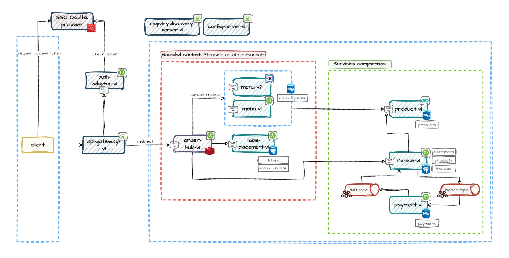
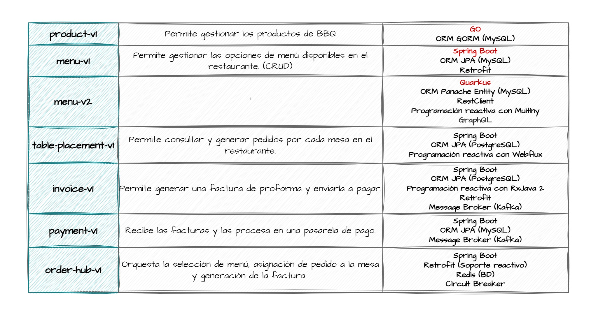

# DEMO MICROSERVICIOS BBQ

- [1. Diagrama de arquitectura de software](#1-diagrama-de-arquitectura-de-software)
- [2. Descripción de los servicios web](#2-descripcion-de-los-servicios-web)
- [3. Gestión de ramas](#3-gestion-de-ramas)
- [4. Estructura del repositorio](#4-estructura-del-repositorio)
- [5. Puertos por defecto](#5-puertos-por-defecto)
- [6. Despliegue local](#6-despliegue-local)
- [7. Orquestación con Docker Compose](#7-orquestacion-con-docker-compose)
- [8. Orquestación con Kubernetes](#8-orquestacion-con-kubernetes)
- [9. Conexión a las bases de datos](#9-conexion-a-base-de-datos)

# 1. Diagrama de arquitectura de software


# 2. Descripcion de los servicios web


# 3. Gestion de ramas
- `config-server`: Contiene los archivos de configuración de los servicios web
- `feature/<feature-name>`: Contiene el código fuente en su versión de desarrollo
- `main`: Contiene la última versión estable del código fuente

# 4. Estructura del repositorio
Los servicios web están en el directorio `/services` y se dividen en dos tipos: negocio e infraestructura.

```javascript
    services
    ├───business
    │   ├───menu-v1
    │   ├───table-placement-v1
    │   └─── ...
    └───infrastructure
        ├───api-gateway-v1
        ├───config-server-v1
        ├───registry-discovery-server-v1
        └─── ...
```

- `business`: Directorio que contiene los servicios web de negocio
- `infrastructure`: Directorio que contiene los servicios web de infraestructura
  - `bbq-parent-v1`: Proyecto de tipo `parent module` para servicios web implementados con Spring Boot
  - `bbq-support-v1`: Proyecto no ejecutable que centraliza las utilidades requeridas por los servicios web implementados con Spring Boot

# 5. Puertos por defecto

| Web service                   | Port   |
|-------------------------------|--------|
| registry-discovery-server-v1  | `8761` |
| config-server-v1              | `8888` |
| api-gateway-v1                | `8010` |
| auth-adapter-v1               | `8011` |
| menu-v1                       | `8012` |
| table-placement-v1            | `8013` |
| invoice-v1                    | `8014` |
| payment-v1                    | `8015` |
| menu-v2                       | `8016` |
| product-v1                    | `8017` |
| order-hub-v3                  | `8018` |

# 6. Despliegue local
- Compilar los proyectos `bbq-parent-v1` y `bbq-support-v1` antes que el resto
- Ejecutar los principales servicios de infraestructura
  - `registry-discovery-server-v1`
  - `config-server-v1`
  - `api-gateway-v1`
- Seguir las indicaciones de cada README para levantar cada servicio web

# 7. Orquestacion con Docker Compose
## 7.1. Construir imágenes
INFRAESTRUCTURA
```shell script
docker build -t miguelarmasabt/registry-discovery-server:v1.0.1 ./services/infrastructure/registry-discovery-server-v1
docker build -t miguelarmasabt/config-server:v1.0.1 ./services/infrastructure/config-server-v1
docker build -t miguelarmasabt/auth-adapter:v1.0.1 ./services/infrastructure/auth-adapter-v1
docker build -t miguelarmasabt/api-gateway:v1.0.1 ./services/infrastructure/api-gateway-v1
```

NEGOCIO
```shell script
docker build -t miguelarmasabt/product:v1.0.1 ./services/business/product-v1
docker build -t miguelarmasabt/menu:v1.0.1 ./services/business/menu-v1
docker build -f ./services/business/menu-v2/src/main/docker/Dockerfile.jvm -t miguelarmasabt/menu:v2.0.1 ./services/business/menu-v2
docker build -t miguelarmasabt/table-placement:v1.0.1 ./services/business/table-placement-v1
```

## 7.2. Iniciar orquestación
Para forzar la recreación de los servicios utilice el flag `--force-recreate`
```shell script
docker-compose -f ./devops/docker-compose/docker-compose.yml up -d
```

## 7.3. Detener orquestación
Para eliminar la orquestación utilice `down -v` en lugar de `stop` 
```shell script
docker-compose -f ./devops/docker-compose/docker-compose.yml stop
```

# 8. Orquestacion con Kubernetes
**[OPCIONAL]** Si usted requiere asignar más memoria RAM a Docker Desktop, cree el archivo `.wslconfig` en la ruta de usuario
`C:\Users\<username>\`, agregue el siguiente contenido y reinicie Docker Desktop.
```javascript
[wsl2]
memory=3072MB
processors=5
```

Asigne el contexto de la CLI de Docker en default
```shell script
docker context use default
```

Encienda el clúster de Kubernetes de Minikube. Puede especificar la cantidad de memoria y CPU destinada al clúster con `--memory=2816 --cpus=4`


```shell script
minikube start
```

> **NOTA**: Desactive el filtro de autenticación para los servicios web que desplegará. Para ello siga las instrucciones
> en el README de api-gateway-v1

## 8.1. Construir imágenes
Las imágenes de nuestros servicios deben estar disponibles en el clúster de Kubernetes de Minikube. Para ello 
establecemos el entorno de Docker de Minikube en nuestra shell y sobre ella construimos las imágenes.

Servicios de infraestructura:
```shell script
docker build -t miguelarmasabt/registry-discovery-server:v1.0.1 ./services/infrastructure/registry-discovery-server-v1
docker build -t miguelarmasabt/config-server:v1.0.1 ./services/infrastructure/config-server-v1
docker build -t miguelarmasabt/auth-adapter:v1.0.1 ./services/infrastructure/auth-adapter-v1
docker build -t miguelarmasabt/api-gateway:v1.0.1 ./services/infrastructure/api-gateway-v1
Invoke-Expression ((minikube docker-env) -join "`n")
```

Servicios de negocio:
```shell script
docker build -t miguelarmasabt/product:v1.0.1 ./services/business/product-v1
docker build -t miguelarmasabt/menu:v1.0.1 ./services/business/menu-v1
docker build -f ./services/business/menu-v2/src/main/docker/Dockerfile.jvm -t miguelarmasabt/menu:v2.0.1 ./services/business/menu-v2
docker build -t miguelarmasabt/table-placement:v1.0.1 ./services/business/table-placement-v1
Invoke-Expression ((minikube docker-env) -join "`n")
```

A continuación, abrimos una shell de Minikube y revisamos que las imágenes hayan sido creadas.
```shell script
docker images
minikube ssh
```

## 8.2. Iniciar orquestación:
```shell script
kubectl apply -f ./devops/k8s/mysql_db/
kubectl apply -f ./devops/k8s/registry-discovery-server-v1/
kubectl apply -f ./devops/k8s/config-server-v1/
kubectl apply -f ./devops/k8s/api-gateway-v1/
kubectl apply -f ./devops/k8s/product-v1/
kubectl apply -f ./devops/k8s/menu-v1/
kubectl apply -f ./devops/k8s/menu-v2/
kubectl apply -f ./devops/k8s/postgres_db/
kubectl apply -f ./devops/k8s/table-placement-v1/
```

Usted puede obtener la URL del servicio `api-gateway-v1` con el siguiente comando: `minikube service --url api-gateway-v1`

## 8.3. Eliminar orquestación:
```shell script
kubectl delete -f ./devops/k8s/mysql_db/
kubectl delete -f ./devops/k8s/registry-discovery-server-v1/
kubectl delete -f ./devops/k8s/config-server-v1/
kubectl delete -f ./devops/k8s/api-gateway-v1/
kubectl delete -f ./devops/k8s/product-v1/
kubectl delete -f ./devops/k8s/menu-v1/
kubectl delete -f ./devops/k8s/menu-v2/
kubectl delete -f ./devops/k8s/postgres_db/
kubectl delete -f ./devops/k8s/table-placement-v1/
```

# 9. Conexion a base de datos
## 9.1. MYSQL
| Parámetro         | Valor (Docker Compose)                         | Valor (Kubernetes)                                    |   
|-------------------|------------------------------------------------|-------------------------------------------------------|
| Server Host       | `localhost`                                    | `localhost`                                           |
| Port              | `3306`                                         | Puerto de Minikube: `minikube service --url mysql-db` |
| Database          | `db_menu_options?allowPublicKeyRetrieval=true` | `db_menu_options?allowPublicKeyRetrieval=true`        |
| Nombre de usuario | `root` o  `bbq_user`                           | `root` o  `bbq_user`                                  |
| Contraseña        | `qwerty`                                       | `qwerty`                                              |

## 9.2. PostgreSQL
- Ubique la pestaña `PostgreSQL` y active la opción `Show all database`.

| Parámetro         | Valor (Docker Compose)     | Valor (Kubernetes)                                       |   
|-------------------|----------------------------|----------------------------------------------------------|
| Connect by        | `HOST`                     | `HOST`                                                   |
| Host              | `localhost`                | `localhost`                                              |
| Port              | `5432`                     | Puerto de Minikube: `minikube service --url postgres-db` |
| Database          | `db_table_orders`          | `db_table_orders`                                        |
| Nombre de usuario | `postgres` o  `bbq_user`   | `postgres` o  `bbq_user`                                 |
| Contraseña        | `qwerty`                   | `qwerty`                                                 |
