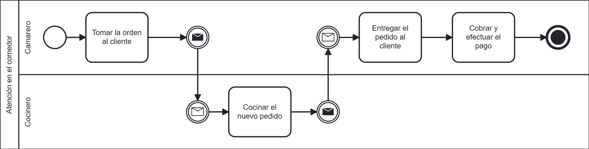

# BBQ RESTAURANT

# 1. Instrucciones de despliegue
- [Local](devops/scripts/local/README.md)
- [Docker](devops/scripts/docker/README.md)
- [Kubernetes](devops/scripts/k8s/README.md)
- [Jenkins](devops/scripts/jenkins/README.md)

# 2. Documentación
- [Backend](./docs/info/backend/README.md)

# 3. Caso de estudio
BBQ Restaurant es una cadena de restaurantes que planea implementar una arquitectura de microservicios para mejorar la escalabilidad y la eficiencia operativa en su creciente red de restaurantes.
Los expertos en el dominio "restaurante" utilizan los siguientes procesos para prestar servicios a sus clientes.

# 4. Arquitectura de software

|    | Servicio web         | Descripción                                                                                                                   | Stack                                                             |   
|----|----------------------|-------------------------------------------------------------------------------------------------------------------------------|-------------------------------------------------------------------|
| 01 | `config-server-v1`   | Servicio de configuraciones.                                                                                                  | **Spring Cloud**                                                  |
| 02 | `api-gateway-v1`     | API Gateway.                                                                                                                  | **WebFlux**: `Webflux`, `WebClient`                               |
| 03 | `auth-adapter-v1`    | Adaptador de autenticación.                                                                                                   | **RxJava**: `Retrofit`                                            |
| 04 | `product-v1`         | Permite gestionar los productos que ofrece el restaurante BBQ (CRUD).                                                         | **GO**: `GORM`                                                    |
| 05 | `menu-v1`            | Permite gestionar las opciones de menú que ofrece el restaurante BBQ (CRUD), siendo las opciones de menú un tipo de producto. | **Spring Boot**: `JPA`, `RestTemplate`                            |
| 06 | `menu-v2`            | Cumple el mismo propósito que menu-v1 (CRUD).                                                                                 | **Quarkus**: `Panache Entity`, `RestClient`, `Multiny`, `GraphQL` |
| 07 | `table-placement-v1` | Permite realizar la colocación de la mesa, es decir que permite agregar pedidos en cada mesa y consultarlos.                  | **WebFlux**: `MongoDB Reactive`, `RouterFunctions`                |
| 08 | `invoice-v1`         | Permite generar una factura de proforma y enviarla a pagar.                                                                   | **WebFlux**: `Retrofit`, `Kafka`, `Drools`, `JPA`                 |
| 09 | `payment-v1`         | Recibe las facturas y las procesa.                                                                                            | **RxJava**: `Kafka`, `JPA`                                        |
| 10 | `order-hub-v1`       | `Backend for Frontend` Construye la experiencia de generación de pedidos.                                                     | **WebFlux**: `Retrofit`                                           |
| 11 | `rules-processor-v1` | Procesador de reglas.                                                                                                         |                                                                   |
