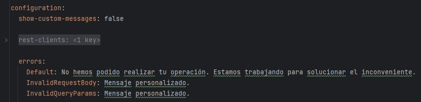
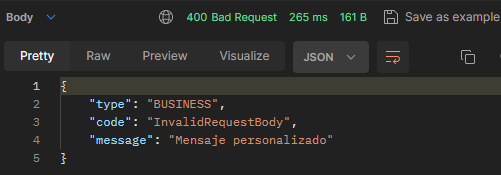
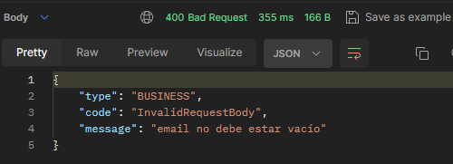

# BACKEND

# 1. Arquitectura de paquetes
La arquitectura de paquetes presentada es solo una plantilla. La implementación real variará según las necesidades 
específicas de cada proyecto.

```javascript
    com.demo.bbq
    │───`rest`
    ├───`application`
    │   ├───constant                //*Constant
    │   ├───dto
    │   │   └───`<context>`
    │   │       ├───request         //*RequestDTO
    │   │       └───response        //*ResponseDTO
    │   ├───enums                   //*Category | *Type
    │   ├───events
    │   │   ├───consumer
    │   │   │   └───`<context>`     //*Consumer
    │   │   │       └───message     //*Message
    │   │   └───producer
    │   │       └───`<context>`     //*Producer
    │   │           └───message     //*Message
    │   ├───mapper                  //*Mapper
    │   └───service                 
    │       └───`<context>`         //*Service & *ServiceImpl
    ├───`repository`
    │   └───`<data-model>`          //*Repository
    │       └───entity | document | request | response  //*Entity | *Document | *RequestWrapper | *ResponseWrapper
    └───`config`
        ├───properties   
        ├───errors   
        └───restclient   
```

# 2. Excepciones y códigos de error HTTP

## Estructura de la respuesta de error

```javascript
{
	"type": "SYSTEM",
	"code": "Default",
	"message": "No hemos podido realizar tu operación. Estamos trabajando para solucionar el inconveniente."
}
```

## Excepciones y códigos de error HTTP
 
| Excepción                  | Código HTTP                                                   | ErrorType  |
|----------------------------|---------------------------------------------------------------|------------|
| `SystemException`          | 500                                                           | `SYSTEM`   |
| `BusinessException`        | 400                                                           | `BUSINESS` |
| `ExternalServiceException` | Reutiliza el código HTTP de la respuesta del servicio externo | `EXTERNAL` |

## Errores de negocio y del sistema
Las siguientes excepciones fueron concebidas con dos constructores que requieren obligatoriamente el código de error.

- Para errores del sistema o configuraciones incorrectas utilizaremos la excepción `SystemException`.
- Para errores de negocio o datos de entrada incorrectos utilizaremos la excepción `BusinessException`.

### Flag de mensajes personalizados
El código de error es útil para asociar el error con un mensaje personalizado especificado en el properties.

- El mensaje personalizado se corresponderá con el error únicamente cuando el flag `configuration.show-custom-messages` esté habilitado.
- El mapa de mensajes personalizados se especifica en la propiedad `configuration.errors`.
- Se debe definir obligatoriamente el mensaje por defecto `configuration.errors.Default`.



### Constructor con un parámetro
Si el flag `show-custom-messages` está habilitado, entonces se utilizará el mensaje personalizado. En caso contrario se 
utilizará el mensaje por defecto.

```javascript
public BusinessException(String code)
public SystemException(String code)
```

### Constructor con dos parámetros
Si el flag `show-custom-messages` está habilitado, entonces se utilizará el mensaje personalizado. En caso contrario se
utilizará el mensaje con el cual se lanzó la excepción.

```javascript
public BusinessException(String code, String message)
public SystemException(String code, String message)
```




## Errores del servicio externo

### Prerrequisitos
- Crear una clase que extienda de `ExternalErrorWrapper`. Esta clase sirve como DTO para mapear la estructura del error del cliente REST.
- Crear una clase que implemente de `ExternalErrorService`. Esta clase define los siguientes métodos:
  - `getCodeAndMessage`: Recupera el código y mensaje a partir de la respuesta del cliente
  - `supports`: Método booleano que permite identificar al servicio.

Durante el consumo del cliente REST 


