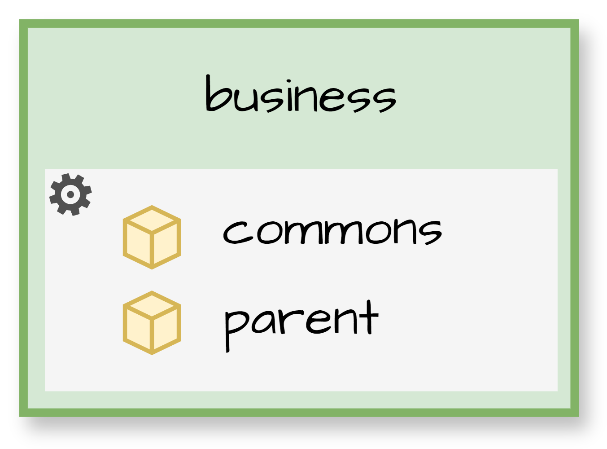

# Módulos

[← Ir a Backend](./../README.md)

En Maven, un `parent module` es un proyecto base que define configuraciones compartidas que otros proyectos pueden reutilizar.

Aunque la implementación varía entre tecnologías, el patrón es el mismo.

## Maven
Los proyectos implementados con Maven tienen el siguiente estándar:
- `parent`: Define el framework base, dependencias comunes y versiones que todos los proyectos heredan.
- `commons`: Proporciona el sistema de código base (utilidades, genéricos, validadores, etc). Depende del parent.
- `business`: Implementa la lógica de negocio específica del proyecto. Depende del commons.

